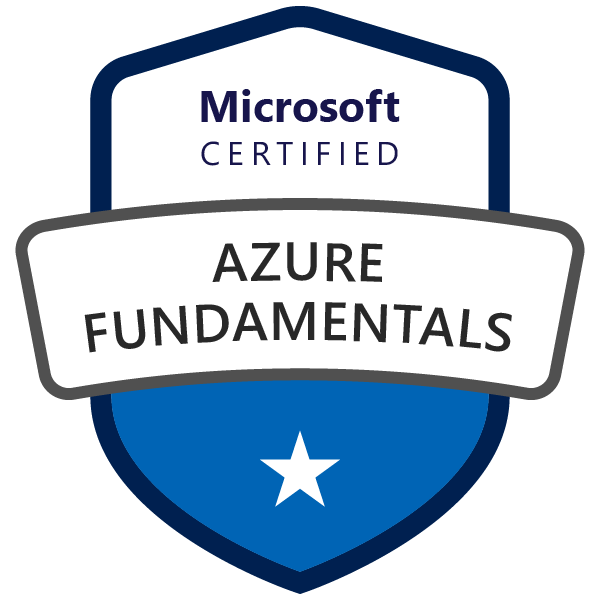

# Hi there, I'm Abdelrhman Hamed 👋

  
  
  

## 🚀 About Me

I'm a passionate **Computer Science student** specializing in **backend and full-stack development**. I love building scalable web applications and solving complex problems with clean, efficient code.

- 🔭 Currently working on a **Graduation Project** - Accommodation Finder for Expat Students
- 🌱 Learning advanced **Django**, **Docker**, and **Cloud Technologies**
- 💼 Looking for **Backend Developer** or **Software Engineering** opportunities
- 📍 Based in Port Said, Egypt
- 📫 Reach me at: h70abdelrahmanelsayed@gmail.com

## 🛠️ Tech Stack

### Languages

### Frameworks & Libraries

### Databases

### Tools & Technologies

## 🎓 Education

**B.Sc. in Computer Science** - The Egyptian E-Learning University  
Expected Graduation: July 2026

**Key Coursework:** Data Structures, Algorithms, OOP, Operating Systems, Databases, Linux

## 🏆 Certifications

## 🤝 Connect with Me

---

  
  
  
  *"Code is like humor. When you have to explain it, it's bad." – Cory House*
  

